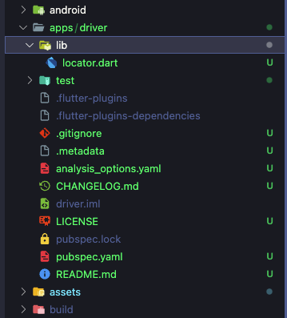

# Apps


This command is used to generate a new app module within the project, which is particularly useful for building super apps or modular applications.

```bash
morpheme apps [apps_name]
```

## Generated Structure

When you run this command, it creates a complete app module structure including:
- **Package Configuration**: Sets up the app as a separate package.
- **Locator**: Registers dependency injection for the app.
- **Project Integration**: Connects the new app module to the main project.
- **Environment**: Sets up development environments.

## Example

Generate a new app module named `driver`:

```bash
morpheme apps driver
```

The `driver` app folder will be created automatically at `apps/driver/`.



:::caution

The app module will not be generated if an app with the same name already exists.

:::
