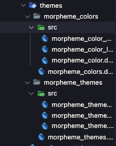

# Color2Dart


This command generates Dart color classes and theme data from YAML configuration files. It streamlines the management of application themes, supporting light/dark modes, custom color palettes, and flavor-specific configurations.

```bash
morpheme color2dart
```

## Setup

First, if you don't have a `color2dart.yaml` in your project (`color2dart/color2dart.yaml`), you need to initialize it:

```bash
morpheme color2dart init
```

This creates a default configuration file in `color2dart/color2dart.yaml`:

```yaml title="color2dart/color2dart.yaml"
# brightness can be 'light' or 'dark'

light:
  brightness: light
  colors:
    white: "#FFFFFF"
    black: "#1E1E1E"
    grey: "#979797"
    primary: "#28A0F6"
    secondary: "#FDA06C"
    # ... other colors
dark:
  brightness: dark
  colors:
    white: "#1E1E1E"
    black: "#FFFFFF"
    grey: "#979797"
    primary: "#28A0F6"
    secondary: "#FDA06C"
    # ... other colors
```

### Material Colors
You can also define `MaterialColor` swatches directly in the YAML:

```yaml
light:
  brightness: light
  colors:
    blue:
      primary: "#2196F3"
      swatch:
          50: "#E3F2FD"
          100: "#BBDEFB"
          200: "#90CAF9"
          300: "#64B5F6"
          400: "#42A5F5"
          500: "#2196F3"
          600: "#1E88E5"
          700: "#1976D2"
          800: "#1565C0"
          900: "#0D47A1"
```

## Global Configuration

You can customize the directory structure in `morpheme.yaml`. If not specified, the command uses the defaults shown below.

```yaml title="morpheme.yaml"
color2dart:
  color2dart_dir: "color2dart"  # Directory containing color definitions (color2dart.yaml)
  output_dir: "lib/themes"      # Output directory for generated theme files
```

## Generated Files

The command generates theme and color classes in `core/lib/src/themes`:



## Usage

### 1. Generate Files
Run the generation command:

```bash
morpheme color2dart
```

### 2. Integration
Integrate the generated themes into your `MaterialApp`. The `Morpheme Flutter Starter Kit` typically handles this via `GlobalCubit`.

```dart
class MyApp extends StatelessWidget {
  const MyApp({super.key});

  @override
  Widget build(BuildContext context) {
    // ... setup
    return BlocProvider(
      create: (context) => GlobalCubit(),
      child: Builder(builder: (context) {
        return MaterialApp.router(
          title: 'Morpheme',
          // Access selected theme from GlobalCubit extension
          theme: context.selectedTheme.themeData,
          darkTheme: context.selectedTheme.themeData,
          // ...
        );
      }),
    );
  }
}
```

### 3. Accessing Colors
Access colors dynamically based on the current theme using the `BuildContext` extension:

```dart
Container(
  color: context.color.primary,
  child: Text(
    'Hello World',
    style: TextStyle(color: context.color.onPrimary),
  ),
)
```

### 4. Changing Themes
Switch themes using the `GlobalCubit` extension methods:

```dart
context.changeTheme(MorphemeThemeDark());
```

## Options

```bash
morpheme color2dart [options]
```

To see all available options and flags, run `morpheme color2dart --help`.

### Available Options

| Option | Abbr | Description | Default |
|---|---|---|---|
| `--flavor [flavor]` | | Generate colors for a specific flavor (e.g., dev, stag, prod). | |
| `--all-flavor` | `-a` | Generate colors for all flavors at once. | `false` |
| `--clear-files` | `-c` | Clear existing generated files before generating new ones. | `false` |
| `--morpheme-yaml [path]` | | Path to a custom configuration file. | `morpheme.yaml` |

## Examples

**Initialize Configuration:**
```bash
morpheme color2dart init
```

**Generate for current flavor:**
```bash
morpheme color2dart
```

**Generate for all flavors:**
```bash
morpheme color2dart --all-flavor
```

**Clean and Generate:**
```bash
morpheme color2dart --clear-files
```
