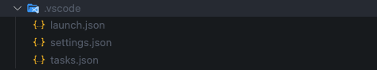

# Config

:::caution

This command is specific to VSCode IDE user.
:::

```bash
morpheme config
```

This command is used to generate the `.vscode/launch.json` and `.vscode/task.json` files according to the configuration in the `morpheme.yaml` file.



## Options

```bash
morpheme config [arguments]
```

To see all available options and flags, run `morpheme config --help`.

### Available Options

- Custom Morpheme Yaml :

| Custom Morpheme Yaml | Description |
|----------|-------------|
| `--morpheme-yaml [path_file]` | This command is used to select yaml config the application in a specific file, by default it will run the `morpheme.yaml` file. |

- Custom Target :
  
| Custom Target | Alternative | Description |
|----------|-------------|-------------|
| `-t [path_file]` | `--target [path_file]` | This command is used to run the application in a specific file, by default it will run the `lib/main.dart` file. |
