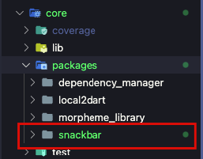

# Core Package


This command generates a new internal package within the `core` module. This is useful for creating reusable, modular components that are shared across different features or apps.

```bash
morpheme core [package_name]
```

## Description
When you generate a core package, it creates a new directory structure inside `core/lib/packages/`. This structure is set up as a standalone Dart package, allowing for clean dependency management and separation of concerns.

## Example

Generate a new core package named `snackbar`:

```bash
morpheme core snackbar
```

This will create a new package at `core/lib/packages/snackbar`.



## Usage

After generating the package, you can:
1.  Implement your reusable logic inside `core/lib/packages/snackbar`.
2.  Export the necessary files in `core/lib/packages/snackbar/snackbar.dart`.
3.  Import and use this package throughout your application.
