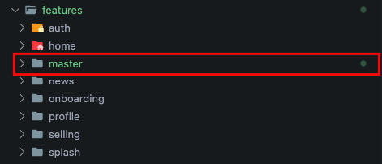

# Feature

This command is used to generate new feature

```bash
morpheme feature [feature_name]
```

## Example

For the example we will generate a new feature named master

```bash
morpheme feature master
```

The feature master folder will be created automatically, we can check in `features/master/`



:::caution

The feature will not be generated if the feature name we enter already exists.

:::

## Options

```bash
morpheme feature [feature_name] [arguments]
```

To see all available options and flags, run `morpheme feature --help`.

### Available Options

- Specific Apps Name :  
  
| Apps Name | Alternative | Description |
|----------|-------------|-------------|
| `-a [apps-name]` | `--apps-name [apps-name]` | Create a new feature module in apps. |
