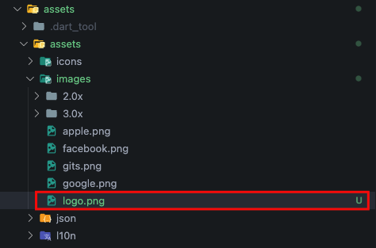
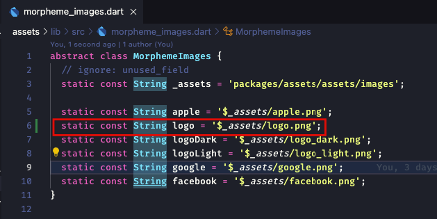

# Assets

Asset has its own module which aims to support all other modules so that they can use the asset, the location of the assets is in `./assets`

## Usages

Here are the steps for creating a logo.png image file as an example:

1. Add the logo files to the `assets/assets/images/` folder

   

2. Generate constants with the [Morpheme CLI](../morpheme_cli/started.md) command:

    ```bash
    morpheme assets
    ```

    Learn more about command assets [here](../morpheme_cli/generate/assets)

    The logo constant will be generated in the `core/assets/lib/morpheme_images.dart` file

    

    :::info

    Adjust the placement of the assets that we use

    - Image file path `assets/assets/images/` constant will be generated in the file `core/assets/lib/morpheme_images.dart`
    - The file path icon `assets/assets/icons/` constant will be generated in the file `core/assets/lib/morpheme_icons.dart`
    - The path of the json file `assets/assets/json/` constant will be generated in the file `core/assets/lib/morpheme_json.dart`

    :::

3. Now you can use `MorphemeImages.logo` in your code

    ```dart
    Image.asset(MorphemeImages.logo);
    ```
