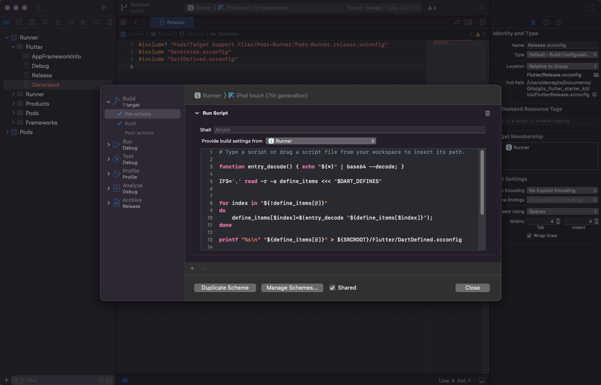

# Environment (morpheme.yaml)

## Summary

`morpheme.yaml` is the config environment used by the morpheme flutter starter kit, developers are required to do run `morpheme init` or copy the existing `morpheme.yaml` file. keep `morpheme.yaml` secret and ignore dare repository.

```yaml title="morpheme.yaml"
project_name: Morpheme
flavor:
  dev:
    FLAVOR: dev
    APP_NAME: Morpheme Dev
    ANDROID_APPLICATION_ID: design.morpheme.dev
    IOS_APPLICATION_ID: design.morpheme.dev
    BASE_URL: https://reqres.in/api
  stag:
    FLAVOR: stag
    APP_NAME: Morpheme Stag
    ANDROID_APPLICATION_ID: design.morpheme.stag
    IOS_APPLICATION_ID: design.morpheme.stag
    BASE_URL: https://reqres.in/api
  prod:
    FLAVOR: prod
    APP_NAME: Morpheme
    ANDROID_APPLICATION_ID: design.morpheme
    IOS_APPLICATION_ID: design.morpheme
    BASE_URL: https://reqres.in/api

firebase:
  dev:
    project_id: "morpheme-dev"
    token: "YOUR FIREBASE TOKEN: firebase login:ci"
  stag:
    project_id: "morpheme-stag"
    token: "YOUR FIREBASE TOKEN: firebase login:ci"
  prod:
    project_id: "morpheme"
    token: "YOUR FIREBASE TOKEN: firebase login:ci"

localization:
  arb_dir: assets/assets/l10n
  template_arb_file: id.arb
  output_localization_file: s.dart
  output_class: S
  output_dir: core/lib/src/l10n
  replace: false

assets:
  pubspec_dir: assets
  assets_dir: assets/assets
  output_dir: assets/lib
  create_library_file: true
  
coverage:
  lcov_dir: coverage/lcov.info
  output_html_dir: coverage/html
  remove:
    - "*/mock/*"
    - "*.freezed.*"
    - "*.g.*"
    - "*/l10n/*"
    - "*_state.dart"
    - "*_event.dart"
    - "**/locator.dart"
    - "**/environtment.dart"
    - "core/lib/src/test/*"
    - "core/lib/src/constants/*"
    - "core/lib/src/themes/*"
    - "lib/routes/routes.dart"
    - "lib/generated_plugin_registrant.dart"
```

## Project Name

`project_name` will be used in some generators for naming files, classes and variables. project_name's default value is `Morpheme`

### Example Default (Morpheme)

```yaml title="morpheme.yaml"
...
project_name: Morpheme
...
```

example to generate assets if we use default or Morpheme for project_name then we run command `morpheme assets`, we see file generated like this:

```console title="Folder Structure"
.
├── assets
│   ├── assets
│   │   ├── images
│   │   │   ├── example.png
│   ├── lib
│   │   ├── src
│   │   │   ├── morpheme_images.dart        # filename generate will prefix morpheme
└── ...
```

```dart title="assets/lib/src/morpheme_images.dart"
abstract class MorphemeImages {             // Prefix class name with morpheme
  // ignore: unused_field
  static const String _assets = 'packages/assets/assets/images';

  static const String example = '$_assets/example.png';
}
```

### Example Custom (Example)

```yaml title="morpheme.yaml"
...
project_name: Example
...
```

example to generate assets if we use default or Morpheme for project_name then we run command `morpheme assets`, we see file generated like this:

```console title="Folder Structure"
.
├── assets
│   ├── assets
│   │   ├── images
│   │   │   ├── example.png
│   ├── lib
│   │   ├── src
│   │   │   ├── example_images.dart        # filename generate will prefix example
└── ...
```

```dart title="assets/lib/src/example_images.dart"
abstract class ExampleImages {             // Prefix class name with example
  // ignore: unused_field
  static const String _assets = 'packages/assets/assets/images';

  static const String example = '$_assets/example.png';
}
```

### List Usages

For more information on the use of `project_name`, see the following list:

- [Assets](./assets) or CLI [morpheme assets](../morpheme_cli/generate/assets)
- [Json2dart](./json2dart) or CLI [morpheme json2dart](../morpheme_cli/generate/json2dart)
- CLI [morpheme config](../morpheme_cli/generate/config)
- CLI [morpheme endpoint](../morpheme_cli/generate/endpoint)
- CLI [morpheme api](../morpheme_cli/generate/api)
- CLI [morpheme unit-test](../morpheme_cli/generate/unit-test)

## Flavor

Flavor has 3 variants `dev`, `stag` and `prod`, each of the variants has the same key but the value can be different from one another. Keys that are `FLAVOR`, `APP_NAME`, `ANDROID_APPLICATION_ID` and `IOS_APPLICATION_ID` used on Android and iOS natively.

The way it works is that the flavor will be changed to the `--dart-define` in cli argument which is used during run or build.

```yaml
...
flavor:
  dev:
    FLAVOR: dev                                         # Mandatory
    APP_NAME: Morpheme Dev                                  # Mandatory
    ANDROID_APPLICATION_ID: design.morpheme.dev         # Mandatory
    IOS_APPLICATION_ID: design.morpheme.dev             # Mandatory
    BASE_URL: https://reqres.in/api
  stag:
    FLAVOR: stag                                        # Mandatory
    APP_NAME: Morpheme Stag                                 # Mandatory
    ANDROID_APPLICATION_ID: design.morpheme.stag        # Mandatory
    IOS_APPLICATION_ID: design.morpheme.stag            # Mandatory
    BASE_URL: https://reqres.in/api
  prod:
    FLAVOR: prod                                        # Mandatory
    APP_NAME: Morpheme                                      # Mandatory
    ANDROID_APPLICATION_ID: design.morpheme             # Mandatory
    IOS_APPLICATION_ID: design.morpheme                 # Mandatory
    BASE_URL: https://reqres.in/api
...
```

### Usages

#### Flutter

```dart title="core/lib/scr/environment.dart"
class Environment {
  static const bool isDev = String.fromEnvironment('FLAVOR') == 'dev';
  static const bool isNotDev = String.fromEnvironment('FLAVOR') != 'dev';
  static const bool isStag = String.fromEnvironment('FLAVOR') == 'stag';
  static const bool isNotStag = String.fromEnvironment('FLAVOR') != 'stag';
  static const bool isProd = String.fromEnvironment('FLAVOR') == 'prod';
  static const bool isNotProd = String.fromEnvironment('FLAVOR') != 'prod';

  static const String baseUrl = String.fromEnvironment('BASE_URL');
}
```

#### Android

To get dart define from argument on android add in `android/app/build.gradle`

```gradle title="android/app/build.gradle"
...
def dartEnvironmentVariables = []
if (project.hasProperty('dart-defines')) {
    dartEnvironmentVariables = project.property('dart-defines')
        .split(',')
        .collectEntries { entry ->
            def pair = new String(entry.decodeBase64(), 'UTF-8').split('=')
            [(pair.first()): pair.last()]
        }
}

android {
    ...
    defaultConfig {
        applicationId dartEnvironmentVariables.APPLICATION_ID               // Take from dart define
        minSdkVersion minSdk
        targetSdkVersion targetSdk
        versionCode flutterVersionCode.toInteger()
        versionName flutterVersionName 
        resValue "string", "app_name", dartEnvironmentVariables.APP_NAME    // Take from dart define
        multiDexEnabled = true
    }
}
```

#### iOS

To get the dart define of the arguments on ios add a pre-action to the scheme runner



```bash
# Type a script or drag a script file from your workspace to insert its path.

function entry_decode() { echo "${*}" | base64 --decode; }

IFS=',' read -r -a define_items <<< "$DART_DEFINES"


for index in "${!define_items[@]}"
do
    define_items[$index]=$(entry_decode "${define_items[$index]}");
done

printf "%s\n" "${define_items[@]}" > ${SRCROOT}/Flutter/DartDefined.xcconfig
```

Then in `Debug.xcconfig` & `Release.xcconfig` add this

```xcconfig
#include "DartDefined.xcconfig"
```

Example usage on ios in `Info.plist`:

```plist
<key>CFBundleDisplayName</key>
<string>${APP_NAME}</string>
```

## Localization / Internationalization

```yaml title="morpheme.yaml"
...
localization:
  arb_dir: assets/assets/l10n
  template_arb_file: id.arb
  output_localization_file: s.dart
  output_class: S
  output_dir: core/lib/src/l10n
  replace: false
...
```

### Configuring localization in morpheme.yaml file

| Option | Description |
|--------|-------------|
| arb-dir | The directory where the template and translated arb files are located. |
| template-arb-file | The template arb file that is used as the basis for generating the Dart localization and messages files. |
| output-localization-file | The filename for the output localization and localizations delegate classes. |
| output-dir | The directory where the generated localization classes are written. This option is only relevant if you want to generate the localizations code somewhere else in the Flutter project. You also need to set the synthetic-package flag to false. <br/><br/> The app must import the file specified in the output-localization-file option from this directory. If unspecified, this defaults to the same directory as the input directory specified in arb-dir. |
| replace | Allow you to replace and merge with default each root .arb if you use separate folder e.g en.arb will be maintained from generate. by default is false |

Learn more about Internationalization [here](./internationalization)

## Firebase

```yaml title="morpheme.yaml"
...
firebase:
  dev:
    project_id: "morpheme-dev"
    token: "YOUR FIREBASE TOKEN: firebase login:ci"
  stag:
    project_id: "morpheme-stag"
    token: "YOUR FIREBASE TOKEN: firebase login:ci"
  prod:
    project_id: "morpheme"
    token: "YOUR FIREBASE TOKEN: firebase login:ci"
```

Learn more about Firebase [here](./firebase)

## Assets

```yaml title="morpheme.yaml"
...
assets:
  pubspec_dir: assets
  assets_dir: assets/assets
  output_dir: assets/lib
  create_library_file: true
...
```

### Configuring assets in morpheme.yaml file

| Option | Description |
|--------|-------------|
| pubspec_dir | The directory where the module assets are located. |
| assets_dir | The directory where the assets are located. |
| assets_dir | The directory where the assets are located. |
| output-dir | The directory where the generated localization classes are written. |
| create_library_file | Allow to generated file dart library with export file-filed generated. |

Learn more about Assets [here](./assets)

## Coverage

```yaml title="morpheme.yaml"
...
coverage:
  lcov_dir: coverage/lcov.info
  output_html_dir: coverage/html
  remove:
    - "*/mock/*"
    - "*.freezed.*"
    - "*.g.*"
    - "*/l10n/*"
    - "*_state.dart"
    - "*_event.dart"
    - "**/locator.dart"
    - "**/environtment.dart"
    - "core/lib/src/test/*"
    - "core/lib/src/constants/*"
    - "core/lib/src/themes/*"
    - "lib/routes/routes.dart"
    - "lib/generated_plugin_registrant.dart"
...
```

### Configuring coverage in morpheme.yaml file

| Option | Description |
|--------|-------------|
| lcov_dir | The directory where the lcov.info are located. |
| output_html_dir | The directory where output the generated report html are written. |
| remove | Ignore or remove pattern dir / file support glob from calculate coverage. |

Learn more about Coverage [here](./coverage)

## References

- <https://medium.com/@tatsu.ukraine/flutter-2-2-dart-defines-and-breaking-changes-here-we-go-again-ce40cfea74fd>
- <https://medium.com/flutter-community/how-to-setup-dart-define-for-keys-and-secrets-on-android-and-ios-in-flutter-apps-4f28a10c4b6c>
