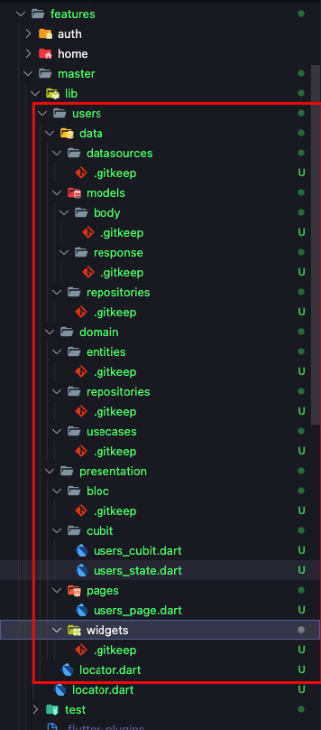

# Page

The morpheme page command has several options and arguments that can be used to create a new page in a feature module. To create a new page in a feature module, you must provide the feature name using the -f or --feature-name option. You can also specify other options depending on how you want to create the page. For example, to create a new page with just UI pages and Cubit, you can use the following command:

```bash
morpheme page [page-name] -f <feature-name>
```

## Example

Here's an example of how you can use the morpheme page command to create a new page in the users feature module, with the feature name set to master:

```bash
morpheme page users -f master
```

As you can see, the command has generated the following files and folders in the users feature module:

- lib/users/presentation/cubit/users_cubit.dart: The Cubit file for the new page.
- lib/users/presentation/pages/users_page.dart: The UI page file for the new page.
- lib/users/presentation/widgets/.gitkeep: An empty file to preserve the widgets folder.
- lib/users/locator.dart: The locator file for the users feature module.
- lib/locator.dart: The main locator file for the entire project.

With these files and folders generated, you can now start adding your own code to create the new page in the users feature module.



:::caution

Page will not be generated if:

- The feature that we enter does not exist
- The page name we entered already exists

:::
